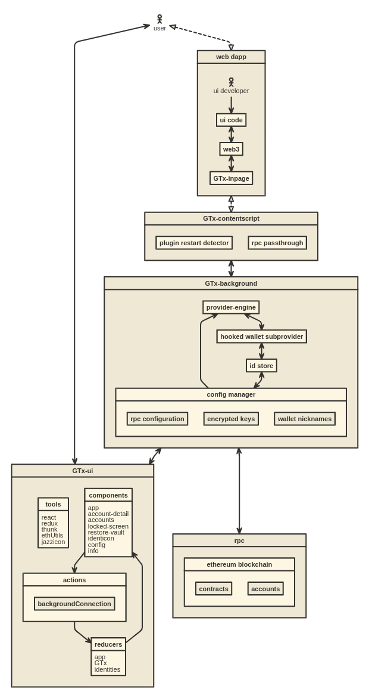

# GTx Wallet Browser Extension

You can find the latest version of GTx on [our official website](https://GTx.io/).

GTx Wallet supports Firefox, Google Chrome, and Chromium-based browsers. We recommend using the latest available browser version.

## Building locally

- Install [Node.js](https://nodejs.org) version 10
    - If you are using [nvm](https://github.com/creationix/nvm#installation) (recommended) running `nvm use` will automatically choose the right node version for you.
- Install [Yarn](https://yarnpkg.com/en/docs/install)
- Install dependencies: `yarn install`
- Copy the `.gtxwalletrc.dist` file to `.gtxwalletrc`
    - Replace the `INFURA_PROJECT_ID` value with your own personal [Infura Project ID](https://infura.io/docs).
- Build the project to the `./dist/` folder with `yarn dist`.
- Optionally, to start a development build (e.g. with logging and file watching) run `yarn start` instead.
    - To start the [React DevTools](https://github.com/facebook/react-devtools) and [Redux DevTools Extension](http://extension.remotedev.io)
      alongside the app, use `yarn start:dev`.
      - React DevTools will open in a separate window; no browser extension is required
      - Redux DevTools will need to be installed as a browser extension. Open the Redux Remote Devtools to access Redux state logs. This can be done by either right clicking within the web browser to bring up the context menu, expanding the Redux DevTools panel and clicking Open Remote DevTools OR clicking the Redux DevTools extension icon and clicking Open Remote DevTools.
        - You will also need to check the "Use custom (local) server" checkbox in the Remote DevTools Settings, using the default server configuration (host `localhost`, port `8000`, secure connection checkbox unchecked)

Uncompressed builds can be found in `/dist`, compressed builds can be found in `/builds` once they're built.

## Contributing

### Running Tests

Run tests with `yarn test`.

You can also test with a continuously watching process, via `yarn watch`.

You can run the linter by itself with `yarn lint`.

## Architecture

[][1]

## Development

```bash
yarn
yarn start
```

## Build for Publishing

```bash
yarn dist
```

## Other Docs

- [How to add custom build to Chrome](./docs/add-to-chrome.md)
- [How to add custom build to Firefox](./docs/add-to-firefox.md)
- [How to add a new translation to GTx](./docs/translating-guide.md)
- [Publishing Guide](./docs/publishing.md)
- [How to use the TREZOR emulator](./docs/trezor-emulator.md)
- [How to generate a visualization of this repository's development](./development/gource-viz.sh)